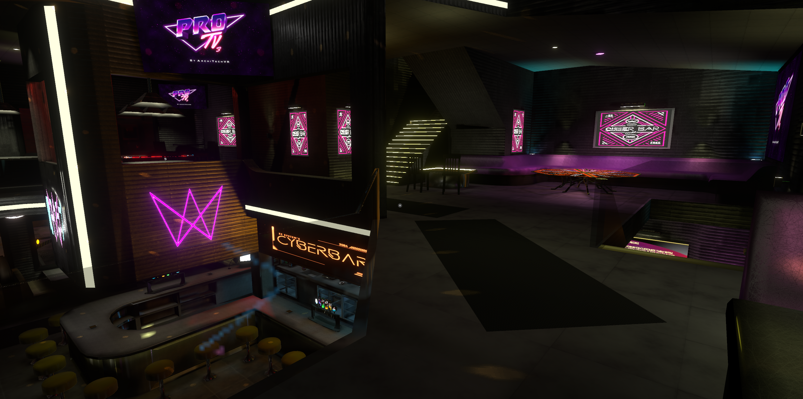

# Purpose and Requirements

> ⚠️ This is a crude summary of the bars and their features. If there's anything important you’d like me to add, feel free to message me.  
> The bartending systems in all bars have been tested by **Cringe**, **Ryo**, and **Sleepy**, and they all seemed to have fun using them.

## Table of Contents

- [Purpose](#purpose)
- [Requirements](#requirements)
- [Current Temporary Venue Options](#current-temporary-venue-options)
  - [Just B Club](#just-b-club)
    - [Security](#security)
    - [Bartending](#bartending)
    - [General Vibe](#general-vibe)
  - [Optimized Bar](#optimized-bar)
    - [Security](#security-1)
    - [Bartending](#bartending-1)
    - [General Vibe](#general-vibe-1)
  - [Cyber Bar](#cyber-bar)
    - [Security](#security-2)
    - [Bartending](#bartending-2)
    - [General Vibe](#general-vibe-2)

## Purpose

This document lists and describes possible bars that could serve as temporary venues for *Point Taken*. Each venue will be evaluated based on the requirements below and tested by a *Point Taken* security member to ensure it fits our needs.

> **Note:** The *Optimized Bar* and *Cyber Bar* are made by the same creator and share the same security and drink systems. Differences between them are primarily visual and atmospheric.

> ⚠️ **Security system disclaimer:** The security systems in the bars have **not yet been tested by an official *Point Taken* security member**. However, one security member has reported that the **Just B Club's system works perfectly fine**.

## Requirements

- A working security system (**this is the most important**)
- A functioning bar system (*not required, but a nice bonus*)

## Current Temporary Venue Options

- Just B Club  
- Optimized Bar  
- Cyber Bar *(uses the same systems as Optimized Bar; both are by the same creator)*

Details on features and how each bar meets the core requirements are listed below.

---

## Just B Club

### Security

By pressing **Arrow Up**, a menu appears that allows the instance owner to customize nearly everything.

  

Under the **Players** tab, security roles can be assigned. Security personnel can then use the tablet at the security booth to grant access by clicking the checkmark next to the player’s name in the player list.

> ✅ A *Point Taken* security member has already confirmed that the Just B Club's security system works perfectly fine in practice.

### Bartending

The bar is located straight ahead and then to the right of the club entrance.

A variety of prefab drinks are available for mixing cocktails.

There appears to be a functional drink mixer as well.

Glasses can be selected from the glass dispenser.

A drink dispenser is also available for easier use.

> **Note:** The bar area is **massive**—visually impressive and spacious, but possibly too large for *Point Taken*'s typical crowd size. This could lead to a sense of emptiness unless the instance is particularly full. The other two bars might feel slightly better scaled for our usual operations.

### General Vibe

Here are some pictures to give a quick impression of the atmosphere:

  
  
  
  
  

---

## Optimized Bar

### Security

The Optimized Bar prompts the instance owner with a claim screen on join. Once claimed, the owner can enable or disable a wide range of features via the tablet near the coffee table—including the security system.

To enable security, select **Network**, then **Access Barrier**.

  

Once active, security staff can use handheld scanners to allow guests into the venue. Until approved, guests remain restricted to the outside area (the street).

Security members allow access by holding the scanner near the guest’s hand and pressing left-click. While this is a bit more effort than using a tablet button, it adds immersion—something higher management may appreciate.

### Bartending

The bar is directly to the right of the entrance.

There are various prefab bottles that can be picked up to pour drinks—perfect for VR immersion.

Desktop users can instead use the drink dispensers.

Glasses can be spawned from a pod near the bar, with a decent selection.

> 🛈 **Note:** A *Point Taken* member has reported that the Optimized Bar may contain **unoptimized windows**, which could potentially cause lag for some users. This should be considered when choosing a venue.

### General Vibe

Some images to give a sense of the atmosphere:

  
  
  
  
  
  
  

---

## Cyber Bar

The Cyber Bar is from the same creator as the Optimized Bar. The claiming and security systems are nearly identical.

### Security

The control tablet for bar customization is located behind the bar or in the back alley behind the venue.

  

Security scanners are positioned at the entrance.

**See the Optimized Bar section for more detail.**

### Bartending

The bar is located straight ahead from the entrance.

It uses the same prefab drink system as the Optimized Bar.

A unique touch: the microwave behind the bar reportedly intensifies the drunk effect, based on recent testing.

**See the Optimized Bar section for more detail.**

### General Vibe

A few shots to get a feel for the mood:

  
  
  
  
  

